# tasks

# 1. *Setup SSH server & only allow SSH port 2202 via firewall*
- Disable password authentication and only allow via ssh keys
- Connect via SSH to that host through key pair only
- Write a script to automatically connect to vm server and take incremental backup (rsync) of
  a directory from vm server to your local directory hourly 

  ## Setting up ssh server and allowing ssh port 2202

At first when we look at the ports that are open and actively listenning. We can see the port 22 is active and is for ssh by default.
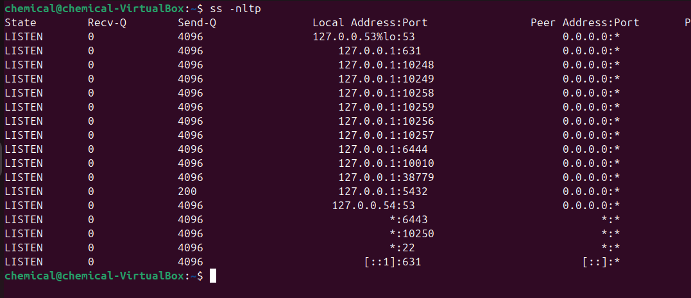
 
 
 
 

Now to change the port number for ssh, we go into the configuration file which is inside the etc dir. Most of the configuration for the linux system is inside this dir. now lets go into /etc/ssh/ and we can see there are many config file. The one we want to look into is sshd_config.
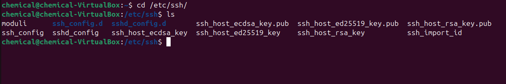

 
 
 
 

we need to change the configuration of sshd_config. We can do this by a text editor. I am gonna use vim to edit the configuration.
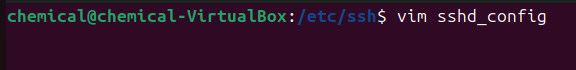
 
 
 
 

inside all the commented configuration are the ones that are by default. If we want to change any of the configuration we can uncomment the line and change it. Here I am gonna change the port number which is set to 22 > 2202.
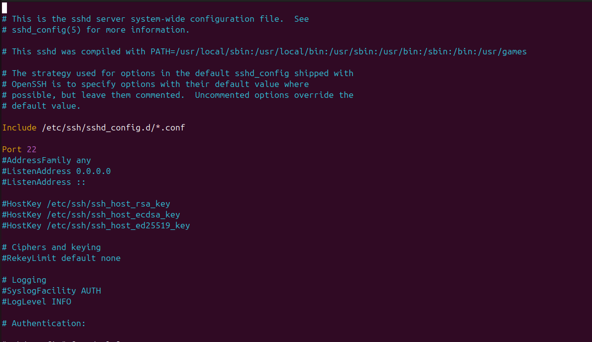
 
 
 
 

Here i change the port number. Likewise if we were to change the password auth, we can search for Password authentication and change the value to "no". By default it would be set to "yes"
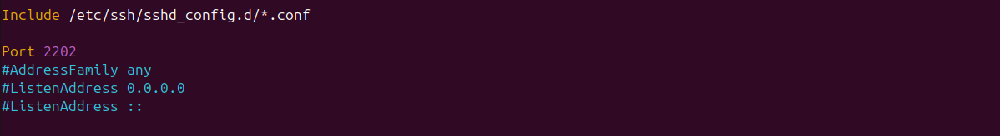
 
 
 
 

before this i had already tried this so it is displaying "skipping adding existing rule" and we do not need to do this step if there are no firewall. Here i am telling my firewall(ufw), to allow ssh on port 2202. for differennt linux distros like centos, redhat there might be different firewalls.
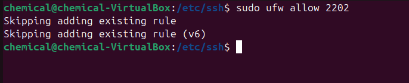

 
 
 
 

Now to put this into effect we need to restart the service ssh by "systemctl restart ssh" or simply reboot the machine. Now if we look into the ports, we can see that the port 22 has been changed to port 2202.
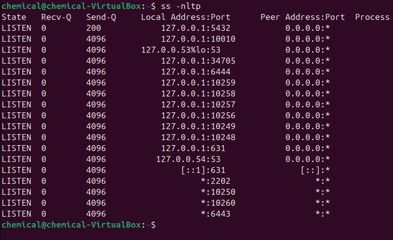

 
 
 
 
Now we can log in to the vm using ssh and since the ssh is not on port 22 anymore, we need to define which port it is by "-p 2202"
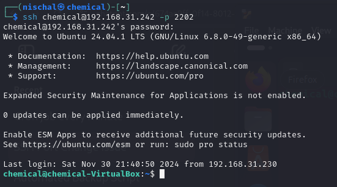

 
 
 
 

-----------------------------------------------------------------------------------------------------------------------------------------------------
 
 
 
 
## Setting up ssh login with ssh-key only and cronjob

Now when we try to login to the vm, we see that we are asked to enter our passwoword.
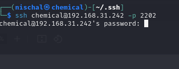
 
 
 
 
One of the methods to login without the password is through ssh-keys & also it is more secured. To use the ssh-keys to login. Lets first create a ssh-key through "rsa" algorithm.
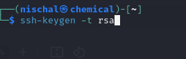
 
 
 
 

We can see that the key has been created and i gave the key-file a name "nischal". Now there will be 2 two keys created. A public and a private one.
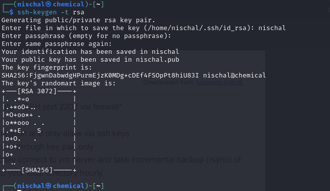
 
 
 
 

Now if we cd into the ~/.ssh/  , we can see that there are two keys. The private key is the key without the extension which is kept in our computer and we share the public key to the remote computer or the computer that we want to log into.
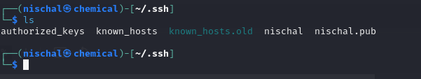
 
 
 
 

We can manually copy the keys and paste it into the vm's .ssh dir but we can also use the command "ssh-copy-id" as in the image below
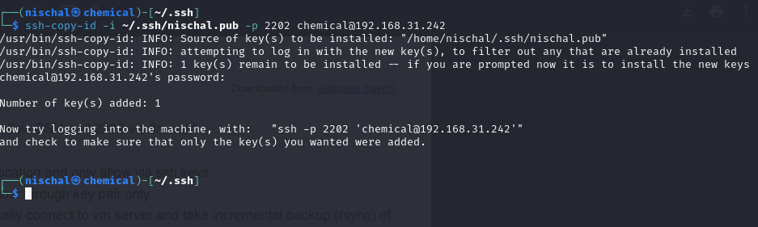
 
 
 
 

the copied key will be automatically added to the authorized_keys file if we use the ssh-copy-id command or else we can manually copy the key

 
 
 
 

if we see inside the authorized_keys we can see that the key has been added.
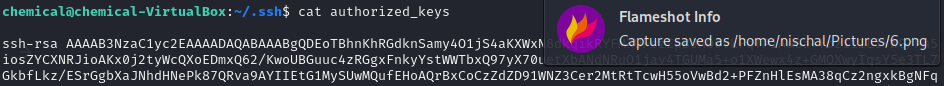
 
 
 
 

Now lets ssh into our machine, i am using the "-i dir" because i changed the deafult key name. if you have not changed the keyname we can simply skip the "-i" part
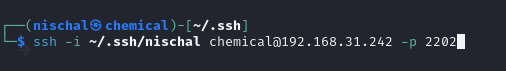
 
 
 
 
Now when we ssh into our machine, we can see that it does not ask for a password anymore
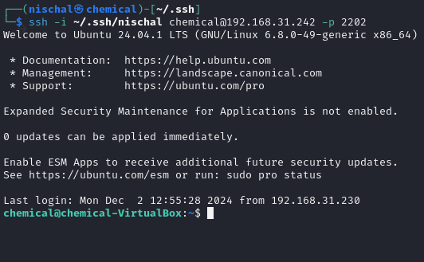
 
 
 
 

I exited the machine and by using the rsync command i can create a backup file of a certain folderin the vm. Here i have created a backup file for "nischalgharti.com.np" dir in the "backup" folder of the vm.
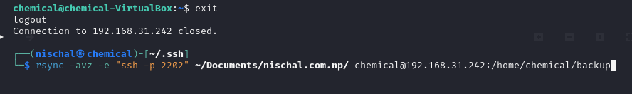
 
 
 
 
by putting the rsync command in the bash.sh folder, we can run a cronjob as below that updates everyhour.
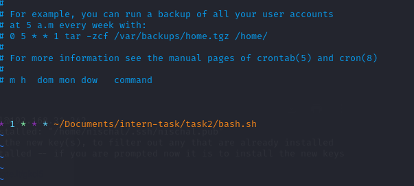
 
 
 
 
